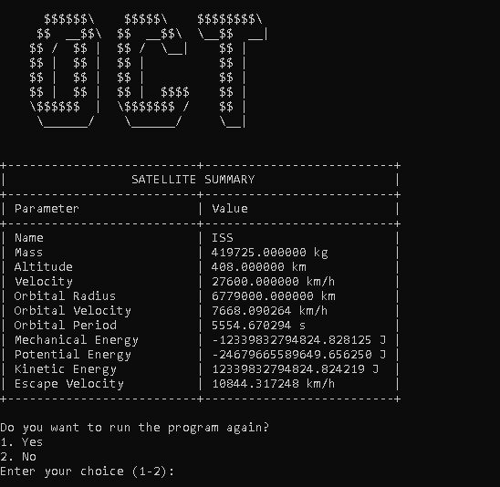

<p align="center">
    
</p>

<h1 align="center">OCT – Orbital Calculation Tool</h1>

## Description

`OCT` is a terminal based cross-platform C++ program that calculates and displays orbital data for satellites.  
It supports both manual and file based input and presents the results in a clearly formatted terminal interface with unit conversion and visual feedback.

## How It Works

1. Lets the user select a measurement system (SI, Imperial or Nautical).
2. Accepts satellite data via manual input or JSON file.
3. Converts units as needed and calculates orbital parameters.
4. Uses animated feedback during computation for better user experience.
5. Displays all physical results in a neatly formatted summary table.
6. Allows exporting the calculated results via a JSON file.
7. Offers the options to restart or exit the program.

## Features

- A beautiful logo.
- Supports SI, Imperial and Nautical units.
- Manual input or JSON file input.
- Fully cross-platform: Windows, Linux amd macOS.
- Accurate physics calculations (velocity, energy, escape speed, etc.).
- JSON based file import/export.
- Clear formatted summary output.
- ANSI colored error messages (universal terminal compatibility).
- Animated `calculation in progress` spinner.
- The option to restart the program at the end or exit it.

## Requirements

- `C++20` compiler (you can use `g++`, `clang++` or `MSVC`).
- Terminal with `ANSI-color` support (`CMD`, `Bash`, `PowerShell`, etc.).
- No external libraries required (only `nlohmann/json.hpp` header, already included).
- `CMake` (optional, for easy cross-platform build).

## Usage

### Build (`with CMake`)

```bash
mkdir build
cd build
cmake ..
make
./oct
```

## Manual Compilation (`with g++`)

```bash
g++ -std=c++20 -Iinclude -Ithird_party/json/single_include \
src/main.cpp src/file_manager.cpp src/satellite.cpp src/satellite_data.cpp src/unit_converter.cpp \
-o oct
```

## Run the Program

```bash
./oct
```

### You will be prompted to:

- Choose unit system (SI, Imperial or Nautical).
- Select data input mode (manual or from JSON file).
- Enter or load satellite parameters.
- View results in terminal.
- Export the results as a JSON file.
- Restart or exit the program.

## Example JSON Input Format

```json
{
    "name": "ISS",
    "mass": 419725,
    "velocity": 27600,
    "altitude": 408
}
```

### Save it as, for example `satellite.json` and run the program to load it.

## Output Example



## Notes

- The program is fully compatible with `Windows`, `Linux`, `macOS` and all common terminals.
- Ensure the `satellite.json` file is in the same directory or subdirectory if loading from file.
- Press `Ctrl+C` to stop the program at any point.

## License

- This project is licensed under the `MIT License`.
- You are free to use, modify and distribute it with attribution.
